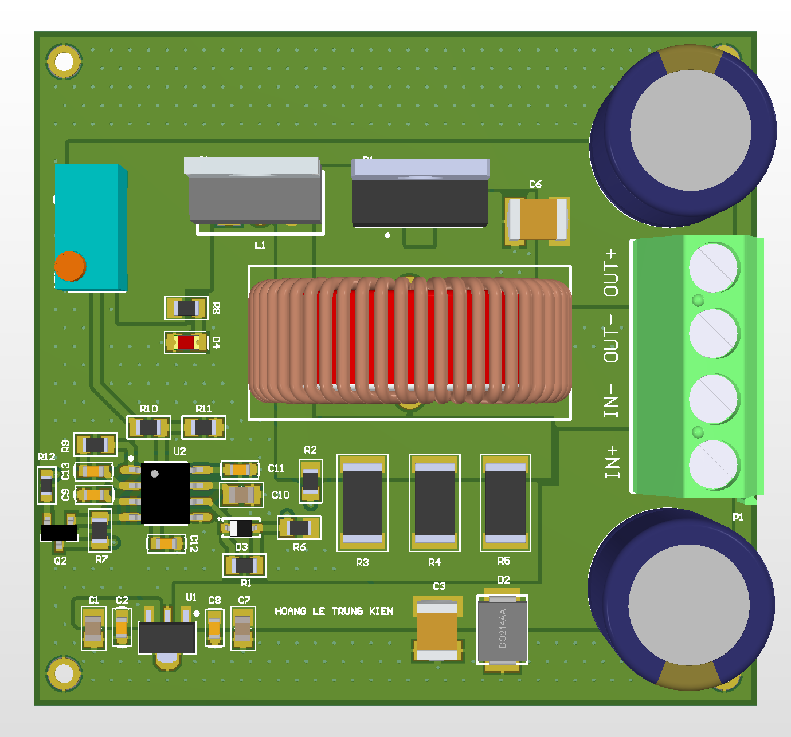

# UC3843 Current-Mode Buck Converter — 2-Layer PCB



> **Status:** Design Complete  
> **Tool:** Altium Designer | **PCB:** 2-Layer  
> **Date:** 2026

---

## Overview

Discrete non-synchronous buck converter designed from scratch using the UC3843 current-mode PWM controller. The schematic is structured into four independent functional blocks — Power Stage, PWM Control, Bias Power, and I/O & Status — mirroring how the circuit would be reviewed in a professional design walkthrough. Component values are derived directly from the UC3843 datasheet application notes.

This project is directly informed by hands-on repair of UC3843-based boards: failures traced through oscilloscope waveforms shaped decisions about gate drive design, snubber placement, and bulk capacitor ESR selection.

---

## Specifications

| Parameter           | Value                                       |
| ------------------- | ------------------------------------------- |
| Input voltage       | 12V DC                                      |
| Output voltage      | ~5V (adjustable via R6/R7 feedback divider) |
| Output current      | Up to 3A                                    |
| Switching frequency | ~100 kHz (set by RT/CT)                     |
| Topology            | Non-synchronous buck (hard switching)       |
| PWM controller      | UC3843AN (current-mode)                     |
| Power switch        | IRFB3607 N-MOSFET                           |
| Rectifier           | MBR20100CT Schottky (dual, 20A)             |
| Bias supply         | 78LJ09 LDO (9V for UC3843 VCC)              |
| PCB layers          | 2                                           |

---

## Block Diagram

```
VIN (12V) ──── POWER STAGE ──── VOUT (5V)
                   │
              UC3843 (PWM CONTROL)
                   │
              78LJ09 (BIAS POWER, 9V)
                   │
              P1 / P2 / LED (I/O & STATUS)
```

---

## Schematic — 4 Functional Blocks

### Block 1: POWER STAGE

```
VIN (+12V) ── D2 (SMA4S5A, TVS protection)
           ── C3 (100nF) + C4 (1000µF) bulk decoupling
           ── IRFB3607 Drain

IRFB3607:
  Gate  ── R1 (10Ω) ── UC3843 OUT (Pin7)
         ── D3 (1N4148) across R1 [fast turn-off bypass]
  Drain ── VIN
  Source ── SW node ── R2 (1kΩ) || R5 (0.1Ω sense) ── GND
                                      ↑
                               ISENSE (to UC3843 Pin3)

SW node ── L1 (100µH) ── VOUT (+5V)
MBR20100CT:
  Cathode ── SW node
  Anode   ── GND
  [Freewheeling diode: conducts when IRFB3607 is off]

VOUT:
  ── C5 (1000µF) + C6 (10µF) output filter
  ── R_feedback (to UC3843 VFB, Pin2)
  ── P2 OUTPUT connector
```

### Block 2: PWM CONTROL (UC3843AN)

```
UC3843AN (DIP-8):
  Pin1 COMP  ── C12 (10nF) + R9 (10kΩ) compensation network ── VOUT
  Pin2 VFB   ── R10 (1kΩ upper) ── VOUT
             ── R11 (1.7kΩ lower) ── GND
             [Vout = 2.5V × (1 + R10/R11) → adjust for 5V target]
  Pin3 ISENSE── R5 (0.1Ω current sense, source of IRFB3607)
  Pin4 RT/CT ── R4 (10kΩ) to GND [timing resistor]
             ── C11 (2.2nF) to GND [timing cap]
             [Fsw = 1.72/(R4 × C11) ≈ 100kHz]
  Pin5 GND   ── Power GND
  Pin6 OUT   ── not used (same as Pin7)
  Pin7 OUT   ── R1 (10Ω) ── IRFB3607 Gate
  Pin8 VCC   ── 9V bias from 78LJ09 ── C6 (100nF) decoupling

Soft-start: C10 (100nF) on COMP pin slows duty cycle ramp-up on power-on
```

### Block 3: BIAS POWER (78LJ09)

```
VIN (12V) ── 78LJ09 VIN
78LJ09:
  VIN  ── C7 (100nF) to GND
  GND  ── Power GND
  VOUT ── VCC net (9V) ── C8 (470µF) + C9 (100nF) filter
                       ── UC3843 Pin8 VCC

Note: 78LJ09 chosen for low dropout at 9V output from 12V input.
VCC must be within UC3843 operating range: 8.4V–30V (Pin8).
UVLO (undervoltage lockout) threshold: 8.4V rising, 7.6V falling.
```

### Block 4: I/O & STATUS

```
P1 (Header 2-pin): VIN+, VIN−  [Input connector]
P2 (Header 4-pin): VOUT+, VOUT−, VIN+, VOUT_SENSE

Status LED:
  VOUT ── R8 (10kΩ) ── D4 (LED red, Anode to R8, Cathode to GND)
  [Lights when output is present]

Output adjustment:
  VR1 (trimmer) in series with R11 allows fine Vout adjustment
  without resoldering — range ±10% of nominal
```

---

## Key Design Decisions

### 1. Gate Drive — Asymmetric R+D

Standard practice: gate resistor (R1 = 10Ω) slows turn-on (limits di/dt and EMI). But turn-off should be fast to minimize switching losses and reduce Miller plateau time.

Solution: D3 (1N4148) placed in parallel with R1, cathode toward UC3843. On turn-on: current flows through R1 (slowed). On turn-off: gate discharge bypasses R1 through D3 (fast). This is the same failure mode found during SMPS repair — slow turn-off causes excessive MOSFET dissipation and eventual failure.

### 2. Current Sense Resistor Value

UC3843 current-mode control uses Pin3 (ISENSE) to implement cycle-by-cycle current limiting. Maximum ISENSE voltage = 1V (UC3843 internal clamp).

```
Ipeak_max = 1V / R5 = 1V / 0.1Ω = 10A (well above 3A operating point)
At 3A: V_sense = 3A × 0.1Ω = 0.3V (within linear range)
Power dissipation: P = I² × R = 3² × 0.1 = 0.9W → use 2W resistor
```

### 3. Freewheeling Diode Selection

MBR20100CT chosen over standard rectifier for:

- Low forward voltage (0.55V typical vs 0.7V silicon) → lower conduction loss
- Fast reverse recovery (prevents shoot-through during transition)
- 20A rating with TO-220 package → directly bolted to heatsink if needed
- Dual diode in parallel in single package → lower thermal resistance

### 4. Compensation Network

UC3843 error amplifier compensation (Pin1 COMP ↔ Pin2 VFB):

```
C12 (10nF) + R9 (10kΩ) set the loop gain crossover.
Target crossover: Fsw/10 = 10kHz
Phase margin: verified by component selection from UC3843 datasheet Figure 12
```

### 5. Layout Informed by Repair Experience

Having traced failures in UC3843-based ATX PSUs and industrial adapters using an oscilloscope:

- **Gate loop**: kept < 2cm² to minimize ringing. Large loops = parasitic inductance = gate oscillation = shoot-through.
- **Snubber placement**: TVS diode (D2) at the drain for voltage spike clamping, placed directly at MOSFET drain pin.
- **Bulk capacitor ESR**: C5 uses low-ESR electrolytic (ESR < 0.1Ω). High ESR = high output ripple = potential feedback instability. Root cause of several repaired board failures.
- **ISENSE trace**: short, direct trace from R5 to Pin3. Long traces add inductance that causes false current limiting triggering.

---

## Frequency Calculation

```
Fsw = 1.72 / (RT × CT)
    = 1.72 / (10kΩ × 2.2nF)
    = 1.72 / (22µs)
    ≈ 78 kHz

To hit 100kHz: CT = 1.72 / (100kHz × 10kΩ) = 1.72nF → use 1.8nF
```

---

## Output Voltage Setting

```
UC3843 internal Vref = 2.5V
Vout = Vref × (1 + R10/R11) = 2.5 × (1 + R10/R11)

For Vout = 5V:
  5 = 2.5 × (1 + R10/R11)
  R10/R11 = 1
  → R10 = R11 = 10kΩ

For other voltages: adjust R10 (upper resistor)
  Vout = 3.3V: R10/R11 = 0.32 → R10 = 3.2kΩ, R11 = 10kΩ
  Vout = 12V:  R10/R11 = 3.8 → R10 = 38kΩ, R11 = 10kΩ
```

---

## BOM

| Ref     | Part         | Value                     | Qty |
| ------- | ------------ | ------------------------- | --- |
| U1      | UC3843AN     | DIP-8, PWM controller     | 1   |
| U2      | 78LJ09       | SOT-89, 9V LDO            | 1   |
| Q1      | IRFB3607     | TO-220, N-MOSFET          | 1   |
| Q2      | (optional)   | heatsink mount            | —   |
| D1      | MBR20100CT   | TO-220, dual Schottky 20A | 1   |
| D2      | SMA4S5A      | SMA, TVS 5V               | 1   |
| D3      | 1N4148       | DO-35, fast switching     | 1   |
| D4      | LED Red      | 0805                      | 1   |
| L1      | Inductor     | 100µH / 5A                | 1   |
| C1      | Ceramic      | 100nF                     | 1   |
| C2      | Ceramic      | 100nF                     | 1   |
| C3      | Ceramic      | 100nF                     | 1   |
| C4      | Electrolytic | 1000µF / 35V              | 1   |
| C5      | Electrolytic | 1000µF / 16V, low ESR     | 1   |
| C6      | Ceramic      | 10µF                      | 1   |
| C7      | Ceramic      | 100nF                     | 1   |
| C8      | Electrolytic | 470µF / 16V               | 1   |
| C9      | Ceramic      | 100nF                     | 1   |
| C10     | Ceramic      | 100nF (soft-start)        | 1   |
| C11     | Ceramic      | 2.2nF (CT timing)         | 1   |
| C12     | Ceramic      | 10nF (compensation)       | 1   |
| R1      | Resistor     | 10Ω / 1W (gate)           | 1   |
| R2      | Resistor     | 1kΩ                       | 1   |
| R3-R5   | Resistor     | 0.1Ω / 2W (sense)         | 3   |
| R4      | Resistor     | 10kΩ (RT timing)          | 1   |
| R6,R7   | Resistor     | 10kΩ (feedback)           | 2   |
| R8      | Resistor     | 10kΩ (LED)                | 1   |
| R9      | Resistor     | 10kΩ (compensation)       | 1   |
| R10,R11 | Resistor     | 10kΩ (feedback divider)   | 2   |
| R12     | Resistor     | 1.7kΩ                     | 1   |
| VR1     | Trimmer      | 5kΩ                       | 1   |
| P1      | Header 2-pin | Input                     | 1   |
| P2      | Header 4-pin | Output + monitor          | 1   |

---

## Files

| File                        | Description               |
| --------------------------- | ------------------------- |
| `schematic/uc3843_buck.pdf` | Full schematic (4 blocks) |
| `docs/layout_top.png`       | PCB layout — top layer    |
| `docs/layout_bottom.png`    | PCB layout — bottom layer |
| `docs/render.png`           | Altium 3D render          |

---

## Connection to Hardware Repair Background

The design decisions in this project are directly traceable to failure modes observed while repairing UC3843-based boards:

| Repair finding                     | Design response                        |
| ---------------------------------- | -------------------------------------- |
| Gate ringing → MOSFET failure      | Asymmetric gate drive (R1 + D3 bypass) |
| High ESR cap → instability         | Low-ESR spec on C5 output filter       |
| Long ISENSE trace → false limiting | Short, direct ISENSE routing           |
| UVLO glitch during startup         | Soft-start cap C10 on COMP pin         |

---

## Tools Used

- Altium Designer 24
- UC3843 datasheet (ON Semiconductor) — compensation network derivation

---

_Design by Hoang Le Trung Kien — HCMUT Electronics & Communication Engineering_
